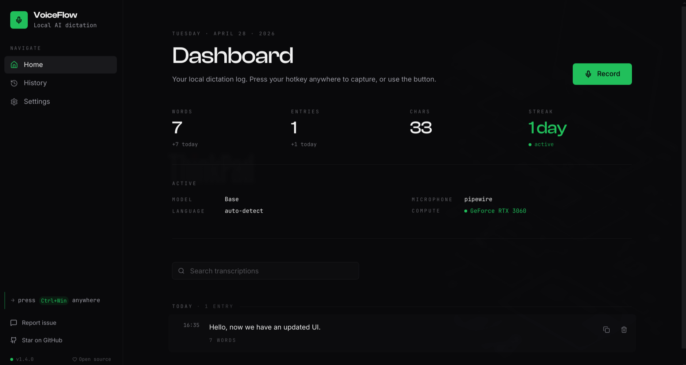
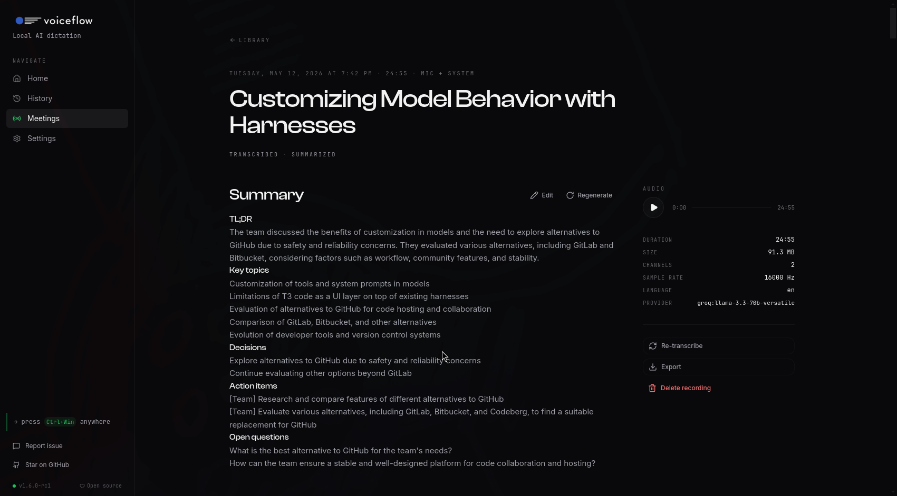

<h1 align="center">
  <picture>
    <source media="(prefers-color-scheme: dark)" srcset="media/logo-dark.png">
    <source media="(prefers-color-scheme: light)" srcset="media/logo-light.png">
    
  </picture>
</h1>

<p align="center">
  Hold a hotkey. Speak. Release. The transcript pastes itself at your cursor.
</p>

<p align="center">
  
</p>

<p align="center">
  Local Whisper dictation for Windows and Linux. No account, no cloud, no monthly bill.
  <br/>
  <sub>macOS builds and runs but isn't officially supported yet.</sub>
</p>

<p align="center">
  <a href="https://github.com/infiniV/VoiceFlow/releases/tag/v1.6.0-rc1"></a>
  <a href="https://github.com/infiniV/VoiceFlow/releases/tag/v1.6.0-rc1"></a>
  <a href="https://get-voice-flow.vercel.app/"></a>
  <a href="LICENSE"></a>
</p>

<p align="center">
  <sub>Latest: <a href="https://github.com/infiniV/VoiceFlow/releases/tag/v1.6.0-rc1"><code>v1.6.0-rc1</code></a> (pre-release) · <a href="https://github.com/infiniV/VoiceFlow/releases">all releases</a></sub>
</p>

---

## What it does

VoiceFlow lives in your system tray. Hold a global hotkey, a small popup pops up with a live amplitude meter, you talk, you release, and the transcript is typed at the cursor. That's it.

The inference runs on your machine through [faster-whisper](https://github.com/SYSTRAN/faster-whisper). CUDA when you have it, CPU when you don't. The audio never touches a network socket.

## Features

- **Fully local.** Audio stays in RAM. No telemetry, no analytics, no phone-home.
- **16+ Whisper models.** Tiny (75 MB) through Large-v3 (3 GB), plus Turbo, distilled, and `.en` variants. The picker shows speed, accuracy, parameter count, and disk size for each.
- **CUDA when available.** Auto-detects your GPU, falls back to CPU.
- **Hold or Toggle modes.** Configurable hotkeys including modifier-only combos like `Ctrl+Win`.
- **Wayland and X11.** Native `evdev` input on Linux, Hyprland window rules, `wl-copy` and `wtype`/`ydotool` for paste.
- **99+ languages.** Whisper handles language detection automatically.
- **Searchable history.** SQLite log of every transcript, stored at `~/.VoiceFlow/`.
- **Dark mode by default.** Light and system themes if you want them.

## Meetings (experimental)

New in [`v1.6.0-rc1`](https://github.com/infiniV/VoiceFlow/releases/tag/v1.6.0-rc1). Long-form recording that captures mic input plus system audio (Zoom, Meet, anything that plays through your speakers) into one stereo file, transcribes it locally, and lets you bring your own LLM for the summary.

<p align="center">
  
</p>

- Pause, resume, and stop from the dashboard or the tray menu.
- Re-transcribe any saved recording with a different model, device, or language without re-recording.
- Bring your own LLM provider: OpenAI, Groq, OpenRouter, Ollama, or any OpenAI-compatible endpoint. API keys are stored in your OS keychain.
- Export to Markdown, plain text, SRT, or structured JSON.
- Auto-rename from a default timestamp to a real topic once the transcript is in.

Recording, transcription, search, and storage stay local. The only network call is the optional summary request, and you can skip it, point it at a local Ollama, or send it to a provider you already pay for.

## VoiceFlow vs cloud dictation

|  | VoiceFlow | Cloud services |
| :--- | :--- | :--- |
| Cost | $0 | ~$10–15/month |
| Where audio goes | Your RAM | Their servers |
| Works offline | Yes | No |
| Account required | No | Yes |
| License | MIT | Closed |

## Install

Grab the latest binary from [Releases](https://github.com/infiniV/VoiceFlow/releases) — currently [`v1.6.0-rc1`](https://github.com/infiniV/VoiceFlow/releases/tag/v1.6.0-rc1) (pre-release):

- **Windows 10/11**: `.exe` installer (Inno Setup)
- **Linux**: `.AppImage` or `.tar.gz`

64-bit only. First launch walks you through a seven-step setup: microphone, compute device, Whisper model download, hotkey. If you delete the model later, a recovery dialog lets you re-download or pick a different one.

## Build from source

```bash
git clone https://github.com/infiniV/VoiceFlow.git
cd VoiceFlow
pnpm run setup        # installs Node and Python deps
pnpm run dev          # Vite frontend + Pyloid backend
```

Platform installers (run on the matching OS):

```bash
pnpm run build:installer          # Windows (.exe via Inno Setup)
pnpm run build:installer:linux    # Linux (.AppImage and .tar.gz)
pnpm run build:installer:macos    # macOS (.dmg, unsupported)
```

## Stack

| Layer | Tech |
| :--- | :--- |
| Shell | [Pyloid](https://github.com/pyloid/pyloid) (PySide6 + Qt WebEngine) |
| Inference | [faster-whisper](https://github.com/SYSTRAN/faster-whisper) (CTranslate2) |
| Frontend | React 18, Vite, Tailwind v4, shadcn/ui |
| Storage | SQLite at `~/.VoiceFlow/VoiceFlow.db` |

## License

MIT. See [LICENSE](LICENSE).

[Releases](https://github.com/infiniV/VoiceFlow/releases) · [Issues](https://github.com/infiniV/VoiceFlow/issues) · [Website](https://get-voice-flow.vercel.app/)
